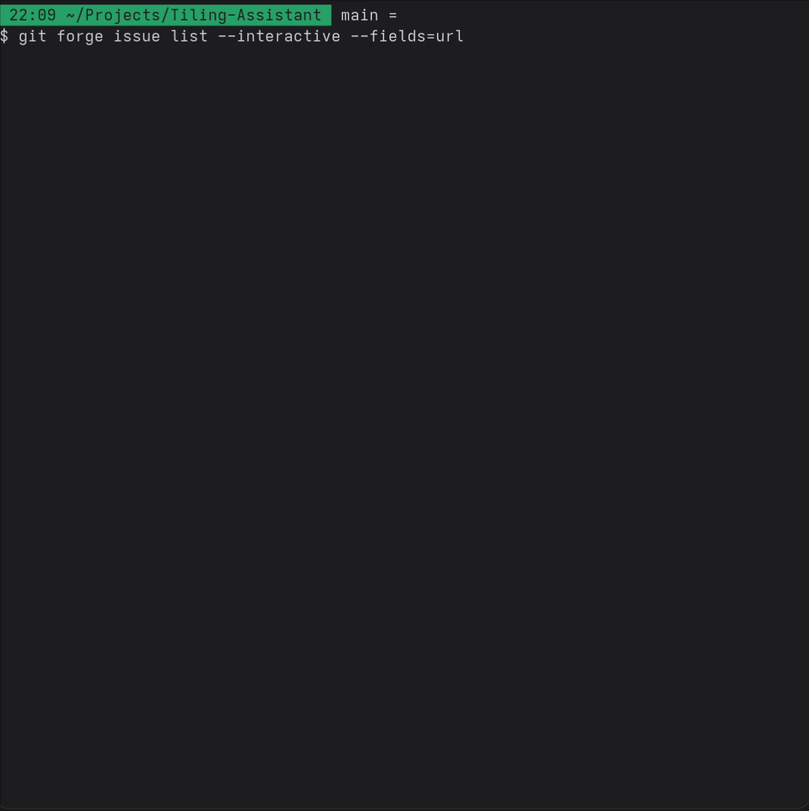
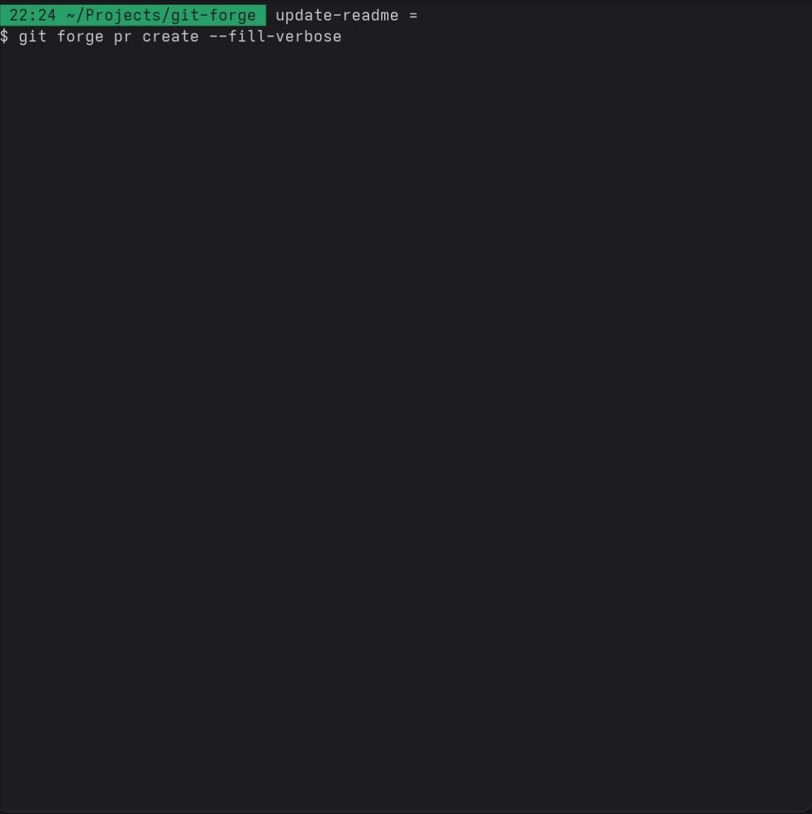

# git-forge

A simple CLI tool for basic interactions with issues and pull requests across GitHub, GitLab, Gitea, and Forgejo.

> [!WARNING]
> This project is mostly for me to practice the Rust programming language. So beware. If you have feedback about the code, feel free to contact me!

## Usage

```sh
# Use -h or --help to get more information about each subcommand and option
git forge [<subcommand>] [<options>]
```

Here is a demo showcasing the interactive issue selection with `git forge issue list --interactive`



Here is a demo showcasing the creation of a PR with automatic filling of the PR title and body based on the git history with `git forge pr create --fill-verbose`



## Features

```sh
# git forge -h
browse       Open repository links in your browser or print them to stdout
completions  Generate shell completions # See limitations below
config       Manage configuration settings
issue        List issues from the remote repository
pr           Interact with pull requests
```

```sh
# git forge browse -h
Open repository links in your browser or print them to stdout

Usage: git-forge browse [OPTIONS] [<PATH[:<LINE_NUMBER>]>]

Arguments:
  [<PATH[:<LINE_NUMBER>]>]  The file or directory to open

Options:
  -c, --commit <COMMIT_ISH>  Open this commit-ish. If <PATH> is provided, open the file at this commit-ish
  -i, --issues [<NUMBER>]    Open the issues page. If <NUMBER> is provided, open that specific issue
  -n, --no-browser           Instead of opening the URL in your browser, print it to stdout
  -p, --prs [<NUMBER>]       Open the PR page. If <NUMBER> is provided, open that specific pr
```

```sh
# git forge config -h
Manage configuration settings. Currently supported settings:

  - editor-command: This command will be called instead of the default text editor when using the --editor flag. E.g. for vscode use `code --wait`
  - <CLI_OPTIONS>: Most CLI options can be configured with a scoped default setting. See the config subcommands' help for more details.

Usage: git-forge config <COMMAND>

Commands:
  get    Get configuration value(s)
  set    Set a configuration value
  unset  Unset a configuration value
  edit   Edit the configuration file
```

```sh
# git forge issue -h
Interact with issues

Usage: git-forge issue <COMMAND>

Commands:
  list    List issues
  create  Create an issue and open it in the web browser
```

```sh
# git forge pr -h
Interact with pull requests

Usage: git-forge pr <COMMAND>

Commands:
  checkout  Checkout a pull request locally
  create    Create a new pull request from the current branch and open the pull request in the web browser
  list      List pull requests
```

### Forge Support

git-forge tries to be forge-agnostic and abstract the forge-specific details away. This is the reason why git-forge only supports common features (e.g. issues, PRs). But even when only implementing common features, forges and their APIs may vary (slightly) in their capability. Here is an overview of each forge's feature set.

|                               | GitHub | GitLab | Gitea/Forgejo                             |
| ----------------------------- | ------ | ------ | ----------------------------------------- |
| `browse --commit <COMMITISH>` | ✅     | ✅     | ✅                                        |
| `browse --issues [<NUMBER>]`  | ✅     | ✅     | ✅                                        |
| `browse --prs [<NUMBER>]`     | ✅     | ✅     | ✅                                        |
| `browse --releases`           | ✅     | ✅     | ✅                                        |
| `completions <SHELL>`         | ✅     | ✅     | ✅                                        |
| `config <SUBCOMMAND>`         | ✅     | ✅     | ✅                                        |
| `issue create [<OPTIONS>]`    | ✅     | ✅     | ✅                                        |
| `issue list [<OPTIONS>]`      | ✅     | ✅     | ✅                                        |
| `pr checkout [<NUMBER>]`      | ✅     | ✅     | ✅                                        |
| `pr create [<OPTIONS>]`       | ✅     | ✅     | ✅                                        |
| `pr list [<OPTIONS>]`         | ✅     | ✅     | ✅ except `--draft` and `--status=merged` |

### Shell Completions

You can generate shell completions for `bash`, `zsh`, `fish`, `powershell`, and `elvish` using:

```sh
git forge completions <shell>
```

You can save the completion script somewhere and source it in your shell configuration.

**But** there is a limitation. The generated completions work for `git-forge` but may not work for `git forge` (note the lack of the hyphen between `git` and `forge`) without modification.

`git forge` uses git's completion. Here you can read about [git's completion setup](https://git-scm.com/book/en/v2/Appendix-A%3A-Git-in-Other-Environments-Git-in-Bash). The generated git-forge completion doesn't integrate well with git's completion since it relies on certain arguments and variables. So you may need to do some manual wiring.

Let's look at bash as an example: The git completion script looks for the function `_git_<command>` when `git <command>` is entered, e.g. `_git_forge()` when typing `git forge`. The `git-forge` completion script defines a function based on the binary name: `_git-forge` (note the hypen instead of the underscore), which adds tab-completion for `git-forge`. You could add a `_git_forge` function that delegates to `_git-forge` to get the completions for `git forge` working:

(Other shells may have similar issues - feedback welcome)

```bash
# This is your generated bash completion script, e.g. git-forge.bash when
# running `git forge completions bash > git-forge.bash`. It already contains
# _git-forge() etc...

# Now *append* the following function
_git_forge() {
    # Adjust COMP_WORDS and COMP_CWORD to make it look like we're completing
    # 'git-forge' instead of 'git forge'
    local -a adjusted_words=("git-forge" "${COMP_WORDS[@]:2}")
    local adjusted_cword=$((COMP_CWORD - 1))

    # Temporarily override COMP_WORDS and COMP_CWORD
    local -a save_words=("${COMP_WORDS[@]}")
    local save_cword=$COMP_CWORD
    COMP_WORDS=("${adjusted_words[@]}")
    COMP_CWORD=$adjusted_cword

    # Call the original completion function with adjusted arguments
    _git-forge "git-forge" "${COMP_WORDS[COMP_CWORD]}" "${COMP_WORDS[COMP_CWORD-1]}"

    # Restore original values
    COMP_WORDS=("${save_words[@]}")
    COMP_CWORD=$save_cword
}
```

## Installation

Download the appropriate [release](https://github.com/Leleat/git-forge/releases) for your system. Rename the downloaded file to `git-forge`, make it executable, and move it into a `$PATH` directory.

### Manual Build

Alternatively, you can build the project manually.

First clone the git repository. Then open a terminal and `cd` into the cloned directory. Then run

```sh
cargo build --release
```

Make `target/release/git-forge` executable and move it to a `$PATH` directory.

## Support Me

If you like this project, you can support me with [GitHub Sponsors](https://github.com/sponsors/leleat).

## License

MIT. See the license file for details.
